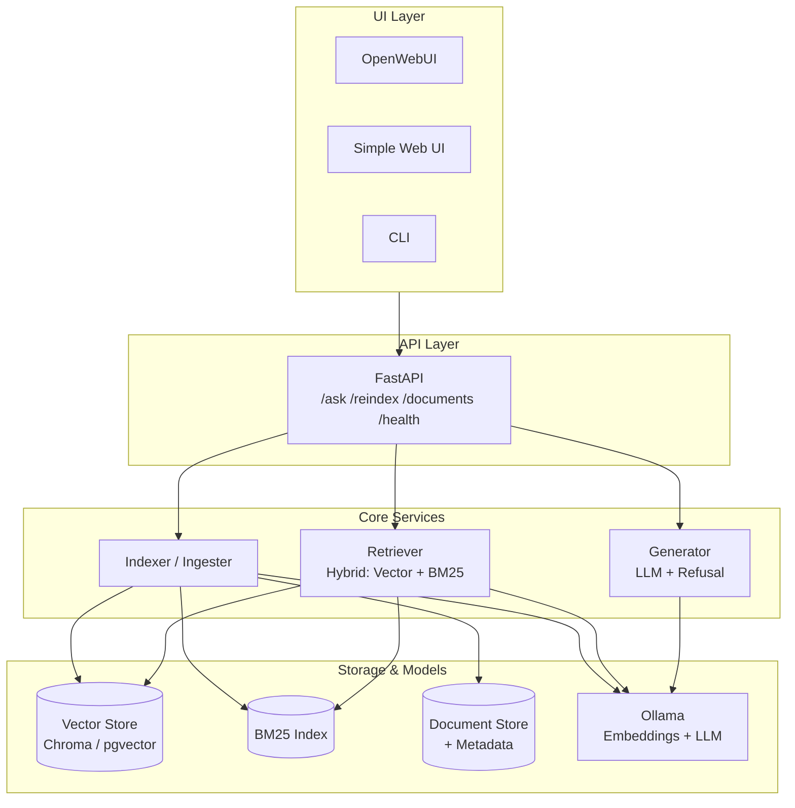
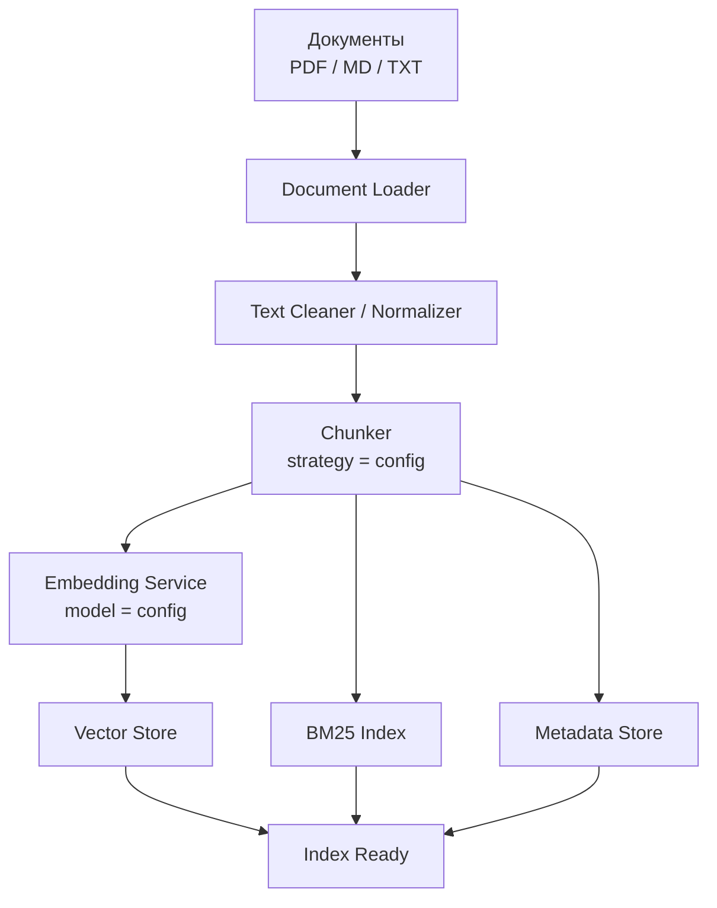
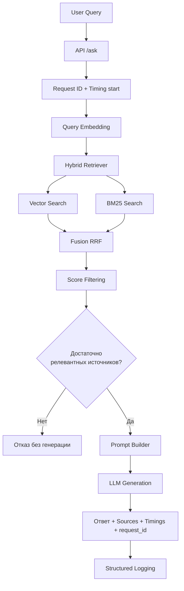

# Архитектура локальной RAG-системы

### Ключевые поинты архитектуры

- Никаких внешних API в runtime (только Ollama)
- Каждый компонент имеет чёткий интерфейс и может быть заменён
- Почти все параметры экспериментов вынесены в конфигурацию
- Лёгкое переключение моделей, стратегий чанкинга, vector store и методов retrieval
- Система умеет честно отказываться, если релевантного контекста недостаточно

---

## 2. Высокоуровневая схема




Придерживаемся классического разделения на **Offline (индексация)** и **Online (запрос)** этапы, а также модульного подхода к компонентам

---

## 3. Компоненты системы

| Компонент | Технология | Назначение |
|---|--|--|
| **UI** | OpenWebUI + простой Web UI / CLI | Интерфейс для пользователей и экспериментов |
| **API** | FastAPI| Единая точка входа, OpenAI-compatible |
| **LLM + Embeddings** | Ollama | Локальные модели эмбеддингов и генерации |
| **Vector Store** | Chroma (по умолчанию) + pgvector| Хранение и семантический поиск |
| **Lexical Search** | rank_bm25 | Компонент hybrid search |
| **Document Store**| Файловая система + metadata (SQLite/JSON) | Исходные документы и метаданные |
| **Config**| YAML + Pydantic Settings| Централизованное управление параметрами |

---

## 4. Потоки данных

### 4.1. Offline-поток (Индексация)



**Точки для экспериментов на этапе индексации:**
- Стратегия чанкинга (`fixed`, `recursive`, `semantic`, `parent_document`)
- `chunk_size` и `chunk_overlap`
- Модель эмбеддингов
- Backend векторного хранилища (`chroma` / `pgvector`)

### 4.2. Online-поток (Запрос)



---

## 5. Разрабатываемые модули

### 5.1. Обязательные модули (ядро системы)

| Модуль              | Ответственность |
|---------------------|-----------------|
| `config`            | Загрузка и валидация конфигурации |
| `document_loader`   | Загрузка документов (MD, PDF, TXT) + метаданные |
| `chunker`           | Разные стратегии чанкинга через единый интерфейс |
| `embedder`          | Обёртка над Ollama embeddings |
| `vector_store`      | Абстракция над Chroma / pgvector |
| `bm25_index`        | Лексический индекс |
| `retriever`         | Hybrid retrieval (vector + BM25 + RRF) |
| `generator`         | Сборка промпта, вызов LLM, логика отказа |
| `api`               | FastAPI-эндпоинты |
| `observability`     | `request_id`, timings, structured logs |

### 5.2. Модули для экспериментов

- `reranker` (опционально)
- `parent_document_retriever`
- `evaluation` — простой скрипт оценки на тестовом наборе
- `experiment_runner` — запуск одного набора вопросов с разными конфигами

---

## 6. Конфигурация

Все ключевые параметры выносятся в `config.yaml` (или `.env` + Pydantic), что-то типа:

```yaml
embedding:
  model: "nomic-embed-text"
  base_url: "http://localhost:11434"

llm:
  model: "qwen2.5:7b-instruct-q4_K_M"
  temperature: 0.1
  base_url: "http://localhost:11434"

chunking:
  strategy: "recursive"  # fixed | recursive | semantic | parent_document
  chunk_size: 800
  chunk_overlap: 150

retrieval:
  top_k: 8
  hybrid: true
  vector_weight: 0.6
  bm25_weight: 0.4
  min_score: 0.32
  refusal_threshold: 0.25

vector_store:
  backend: "chroma"    # chroma | pgvector
  persist_directory: "./data/chroma"

paths:
  documents: "./data/documents"
  index: "./data/index"
  evaluation: "./data/evaluation"
```

Это нам будет позволять:
- Менять модель эмбеддингов и LLM одной строкой
- Переключать backend векторного хранилища
- Сравнивать стратегии чанкинга
- Включать/выключать hybrid search
- Менять пороги отказа и `top_k`

----

### 7. Источники и обоснование архитектурных решений

Примечание:Тут перечислены ключевые материалы, которые повлияли на принятие решений. Это потом в процессе написания диплома буду использовать

#### 7.1. Обзорные и теоретические материалы

| Источник | Что взято | Зачем использовано |
|---------|-----------|--------------------|
| [Часть 1. Обзор подходов RAG](https://habr.com/ru/articles/893650/) | Классификация парадигм: Naive RAG -> Advanced RAG -> Modular RAG. Разделение на pre-retrieval / retrieval / post-retrieval этапы. | Обоснование выбора **модульной** архитектуры вместо монолитного пайплайна. Позволило чётко выделить точки расширения (chunking, hybrid, rerank, ....)|
| [Retrieval-Augmented Generation (RAG): глубокий технический обзор](https://habr.com/ru/articles/931396/) | Детальное описание offline/online разделения, роли embedding model, vector store и generator | Легло в основу разделения потоков (Offline индексация / Online запрос) и выбора основных компонентов|
| [Что такое RAG-система? Полный разбор...](https://habr.com/ru/companies/otus/articles/835930/) | Базовые этапы RAG и практические рекомендации по чанкингу и качеству retrieval | Использовалось при формулировании обязательных модулей и требований к качеству чанкинга|

#### 7.2. Практические локальные реализации

| Источник | Что взято | Зачем использовано |
|---------|-----------|--------------------|
| [Локальный RAG без магии: sources, timings, request_id и отказ от генерации](https://habr.com/ru/companies/bothub/articles/1037946/) | Обязательность `request_id`, замеров времени по этапам, возврата sources + score, логики **отказа** при низком score| Стало одним из центральных принципов архитектуры + эти элементы заложены в Online-поток и модуль `observability` / `generator` |
| [Локальная RAG-система на Go, PostgreSQL и Ollama](https://habr.com/ru/companies/gram_ax/articles/1020248/) | Полностью локальный стек (Ollama + собственный backend), отсутствие облачных API, простой и прозрачный пайплайн | Подтвердило выбор **Ollama** как единственного runtime для моделей и подход своего тонкого backend вместо тяжёлого фреймворка |
| [Как я сделал локальный RAG-сервис для SRE...](https://habr.com/ru/articles/1005776/) и связанные статьи | Использование RAG для технической документации, runbook’ов и кода; акцент на практической полезности | Повлияло на целевой сценарий системы (документация, поддержка, снижение времени разбора задач) и на требования к прозрачности ответов |

#### 7.3. Hybrid Search, критика фреймворков и практические паттерны

| Источник | Что взято | Зачем использовано |
|---------|-----------|--------------------|
| [Hybrid RAG knowledge base... и опасность RAG-фреймворков](https://habr.com/ru/articles/1005776/) | Критика избыточной абстракции LangChain/LlamaIndex в продакшене; рекомендация минимального прозрачного стека (API + vector + BM25 + LLM); ценность hybrid search| Прямо повлияло на решение **не** строить систему вокруг тяжёлого фреймворка, а реализовать тонкий FastAPI + собственные сервисы. Hybrid search (vector + BM25 + RRF) стал обязательным компонентом|
| [Как я победил в RAG Challenge](https://habr.com/ru/articles/893356/) | Важность качественного парсинга, сериализации таблиц, re-ranking и контроля над каждым этапом пайплайна | Усилило требования к модулю `document_loader` / `chunker` и к возможности экспериментировать с post-retrieval этапами |

#### 7.4. Доп. обоснования

- **Выбор Chroma для использования по умолчанию + pgvector как альтернатива** — компромисс между простотой развёртывания на ноутбуке и возможностью сравнения более «взрослых» решений (в духе статей с PostgreSQL + pgvector)
- **Config-driven подход** — необходим для выполнения исследовательской части диплома (сравнение моделей, стратегий чанкинга, методов retrieval)
- **Отказ от GraphRAG в качестве основного пути** — на текущем этапе приоритет отдан классическому Vector + Hybrid RAG как более реализуемому, GraphRAG пока оставляем возможным направлением развития
