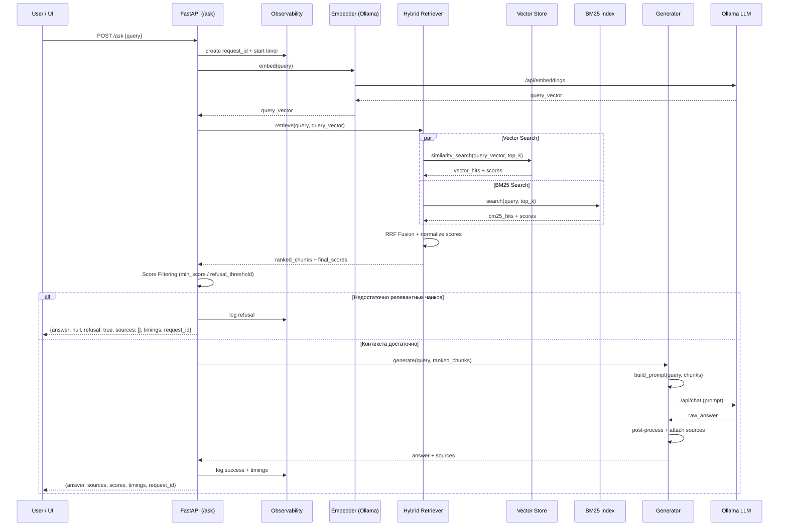

# Детальная архитектура Retrieval и Generation

**Цель:** Спроектировать полный путь преобразования пользовательского вопроса в ответ:

```
Вопрос -> Embedding -> Hybrid Retrieval -> Score Filtering ->
Prompt Building -> LLM Generation -> Ответ + Sources + Timings
```

или

```
Вопрос -> ... -> Score Filtering -> Отказ (без генерации)
```

---

## 1. Высокоуровнево Sequence-диаграмма



---

## 2. Векторизация вопросов

### Как устроено

1. Пользовательский вопрос приходит в `/ask`
2. Берётся **та же модель эмбеддингов**, которая использовалась при индексации (из `config.embedding.model`)
3. Вызов идёт в Ollama (`/api/embeddings`)
4. Полученный вектор используется и для vector search, и (при необходимости) для дополнительных проверок

### Важные поинты для разрабтки

- Модель эмбеддингов должна совпадать с той, что была при индексации. Иначе качество поиска будет падать
- Векторизация вопроса должна логироваться (время + модель)
- При ошибке Ollama запрос завершаем с понятной ошибкой (чтобы не падать молча)

```python
class Embedder(ABC):
    @abstractmethod
    def embed_query(self, text: str) -> list[float]:
        ...

    @abstractmethod
    def embed_documents(self, texts: list[str]) -> list[list[float]]:
        ...
```

---

## 3. Поиск (Hybrid Retrieval)

### 3.1. Общая схема

Используем **Hybrid Search**:

- Dense retrieval (vector similarity) — семантическая близость
- Sparse retrieval (BM25) — точное совпадение терминов, кодов ошибок, названий endpoint’ов и т.д.
- Объединение через Reciprocal Rank Fusion (RRF)

**Это решение взято из статей по Hybrid RAG и подтверждено как один из самых эффективных способов повысить recall на технических текстахх*

### 3.2. Vector Search

Поддерживаем 2 backend’а (через абстракцию):

| Backend | Когда используем | Особенности |
|----|-------|-----------|
| **Chroma**  | По умолчанию, ноутбук       | Просто, быстро поднимается |
| **pgvector**| Эксперименты | Можно делать более сложные фильтры, join’ы с метаданными |

Интерфейс:

```python
class BaseVectorStore(ABC):
    @abstractmethod
    def similarity_search(
        self,
        query_embedding: list[float],
        top_k: int = 8,
        filters: dict | None = None
    ) -> list[RetrievalResult]:
        ...
```

`RetrievalResult` содержит:
- `chunk: DocumentChunk`
- `score: float` (cosine / inner product)
- `rank: int`

### 3.3. BM25 Search

Используем `rank_bm25` (или аналог мб как эксперимент). Индекс строится на этапе ingestion по тем же чанкам

### 3.4. Fusion (RRF)

```text
score(chunk) = Σ 1 / (k + rank_i(chunk))
```

где `k` обычно 60

После fusion результаты пересортировываются и обрезаются до `top_k`

### 3.5. Интерфейс Retriever

```python
from dataclasses import dataclass
from typing import Optional

@dataclass
class RetrievalResult:
    chunk: DocumentChunk
    score: float
    source_rank: dict[str, int] # {"vector": 2, "bm25": 5}
    final_rank: int


class BaseRetriever(ABC):
    @abstractmethod
    def retrieve(
        self,
        query: str,
        query_embedding: list[float],
        top_k: int | None = None
    ) -> list[RetrievalResult]:
        """возвращает отранжированный список чанков с финальными скорами"""
        ...
```

Реализация по умолчанию — `HybridRetriever`

---

## 4. Обработка случая «Нет данных» (Refusal Logic)

**Один из ключевых принципов архитектуры (взято напрямую из статьи Bothub «Локальный RAG без магии»)*

### Пороги (определяем в конфиге)

```yaml
retrieval:
  top_k: 8
  min_score: 0.32 # min score после fusion
  refusal_threshold: 0.25  # если лучший score ниже - отказ
  min_relevant_chunks: 1 # сколько чанков должно пройти порог
```

### Логика

1. После hybrid retrieval берём лучший `score`
2. Если `best_score < refusal_threshold` -> отказ без вызова LLM
3. Если количество чанков с `score >= min_score` < `min_relevant_chunks` -> тоже отказ
4. В случае отказа возвращаем:

```json
{
  "request_id": "...",
  "answer": null,
  "refusal": true,
  "refusal_reason": "insufficient_relevant_context",
  "sources": [],
  "timings": {...}
}
```

**важно для снижения галлюцинаций и повышения доверия к системе*

---

## 5. Формирование промпта

### Важные поинты:

- Чанки подаются в порядке убывания релевантности
- Каждый чанк идет вместе с источником (filename + page/section)
- Промпт жёстко инструктирует модель отвечать **только** на основе предоставленного контекста
- Есть явное указание: если информации недостаточно - сказать об этом

### Шаблон промпта (базовый)

**мб потом доработается*

```text
Ты - помощник по внутренней технической документации.
Отвечай ТОЛЬКО на основе приведённого ниже контекста.
Если в контексте нет информации для ответа - честно скажи, что данных недостаточно.

Контекст:
--------------------
[Источник: incident-db.md, стр. 3]
Текст чанка 1...

[Источник: runbook-postgres.md, раздел 2.1]
Текст чанка 2...
--------------------

Вопрос пользователя: {query}

Ответ:
```

### Интерфейс Generator

```python
@dataclass
class GenerationResult:
    answer: str | None
    sources: list[dict] # [{chunk_id, source, page, score, content_preview}]
    refusal: bool = False
    refusal_reason: str | None = None
    raw_llm_response: str | None = None


class BaseGenerator(ABC):
    @abstractmethod
    def generate(
        self,
        query: str,
        retrieved: list[RetrievalResult]
    ) -> GenerationResult:
        ...
```

---

## 6. Возврат источников

**Каждый ответ (даже при частичном успехе) обязан содержать источники*

Формат источника:

```json
{
  "chunk_id": "doc123_chunk_007",
  "source": "docs/runbooks/incident-db.md",
  "filename": "incident-db.md",
  "page": 3,
  "section": "2.3 Диагностика",
  "score": 0.81,
  "content_preview": "Первые 200-300 символов чанка..."
}
```

**источники сортируем по убыванию `score`*

---

## 7. Observability

Каждый запрос у нас сопровождается данными:

| Поле   | Описание |
|------|----------|
| `request_id` | UUID запроса |
| `timings.embed_ms`| Время векторизации вопроса |
| `timings.retrieve_ms` | Время hybrid search |
| `timings.generate_ms` | Время генерации LLM |
| `timings.total_ms`| Общее время |
| `retrieved_count` | Сколько чанков вернул retriever |
| `used_count`| Сколько чанков реально пошло в промпт |
| `refusal` | Было ли отказное срабатывание |

---

## 8. Конфигурация (релевантная часть)

```yaml
retrieval:
  top_k: 8
  hybrid: true
  vector_weight: 0.6 # пока для будущего взвешивания
  bm25_weight: 0.4
  min_score: 0.32
  refusal_threshold: 0.25
  min_relevant_chunks: 1

llm:
  model: "qwen2.5:7b-instruct-q4_K_M"
  temperature: 0.1
  max_tokens: 1024

embedding:
  model: "nomic-embed-text"
```

---

## 9. Опора на источники

| Источник | Что взято | Зачем использовано |
|---------|-----------|--------------------|
| [Локальный RAG без магии: sources, timings, request_id и отказ от генерации](https://habr.com/ru/companies/bothub/articles/1037946/) | обязательность `request_id`, timings по этапам, возврат sources + score, логика отказа при низком score | Фундамент Online-пайплайна и модулей Retriever / Generator / Observability |
| [Hybrid RAG knowledge base... и опасность RAG-фреймворков](https://habr.com/ru/articles/1005776/) | Hybrid search (vector + BM25) + RRF как практический стандарт; критика тяжёлых фреймворков | как обоснование выбора hybrid retrieval и собственной реализации вместо LangChain |
| [Retrieval-Augmented Generation (RAG): глубокий технический обзор](https://habr.com/ru/articles/931396/) | Чёткое разделение Retrieval -> Augmentation -> Generation | Легло в основу sequence-диаграммы и разделения ответственности между Retriever и Generator |
| [Часть 1. Обзор подходов RAG](https://habr.com/ru/articles/893650/) | Advanced / Modular RAG, post-retrieval этапы | Подтвердило необходимость score filtering и возможности дальнейшего добавления reranker |
| Практики локальных реализаций (gram_ax, SRE-статьи) | Полностью локальный стек + прозрачность | Усилило требования к отсутствию внешних API и к возвращаемым источникам |
