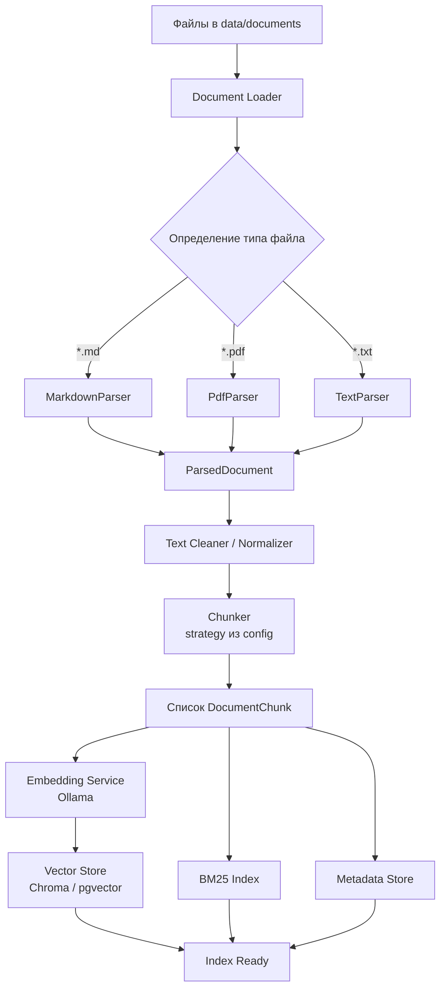

# Архитектура Ingestion Pipeline (доки)

**Цель:** Превратить исходные файлы документации в набор чанков с эмбеддингами и метаданными, готовых для поиска

**Общий поток:** Файл -> Текст (+ метаданные) -> Чанки -> Эмбеддинги -> Vector Store + BM25 + Metadata Store

Надо, чтобы пайплайн был:
- Модульным (легко менять парсер / стратегию чанкинга / модель эмбеддингов)
- Прозрачным (каждый этап логируется)
- Удобным для экспериментов
- Устойчивым к разным форматам документов

---

## 1. Поддерживаемые форматы файлов

| Формат     | Приоритет | Обоснование |
|------------|---------|-----------|
| **Markdown (.md)** | Высокий | Основной формат технической документации, runbook'ов, README |
| **PDF (.pdf)**     | Высокий | Большинство регламентов, инструкций, отчётов |
| **Plain Text (.txt)** | Средний | Простые текстовые файлы |
| **DOCX** | Средний | Частый формат документов |
| **HTML (.html)**   | Низкий (опционально) | Можно добавить позже, легко сегментиурется |

---

## 2. Инструменты парсинга

| Формат | Инструмент | Почему выбран |
|--------|----------|-------------|
| Markdown | Встроенный + `markdown-it-py` / простой regex + frontmatter | Просто, быстро, хорошо сохраняет структуру |
| PDF | ? | ? |
| TXT | Простое чтение с определением кодировки (`chardet`) | Максимально просто |
| Универсальный слой | Собственный `BaseParser` | Единый интерфейс для всех форматов |


Можно cделать абстракцию `BaseParser` + конкретные реализации (`MarkdownParser`, `PdfParser`, `TextParser`), это позволит легко добавлять новые форматы и сравнивать парсеры в экспериментах

### 2.1. Стратегия обработки PDF (детально)

#### Основные сложности PDF

- Многоколоночная вёрстка (текст из колонок перемешивается)
- Сложные и большие таблицы (теряется связь заголовка и значений)
- Сканированные документы (нужен OCR)
- Колонтитулы, номера страниц, водяные знаки
- Повёрнутые таблицы и нестандартная ориентация
- Графики и изображения, содержащие важную информацию
- Нарушенные шрифты / «зашифрованный» текстовый слой

**Грустно, но важно:** ни один парсер не извлекает информацию идеально, поэтому архитектура должна быть устойчива к неидеальному тексту

#### Потенциальный подход

| Слой | Инструмент | Роль |
|------|----------|------|
| **Основной (по умолчанию)** | **PyMuPDF** (`pymupdf` / `fitz`) + `pymupdf4llm` | Быстрое извлечение текста + попытка сохранить структуру в Markdown. Хорошо работает на «цифровых» PDF|
| **Альтернатива / эксперименты** | **pdfplumber** | Лучше извлекает таблицы с явными границами |
| **Тяжёлая артиллерия (опционально)** | **Docling** (IBM) | Значительно лучше работает со сложной вёрсткой и таблицами, но тяжелее по зависимостям |
| **Сканы** | Пока **не поддерживаем** полноценно (можно добавить OCR позже через Tesseract / PaddleOCR) | Опционально |

#### Практическая стратегия обработки PDF

1. Определяем, есть ли текстовый слой (через PyMuPDF)
2. Далее если текстовый слой почти пустой, то помечаем документ как `scanned` и пока пропускаем (или логируем предупреждение)
3. Извлекаем текст постранично с сохранением номера страницы
4. Пытаемся сохранить структуру заголовков (через `pymupdf4llm` → Markdown)
5. Таблицы:
   - На первом этапе — извлекаем как текст (даже если структура ломается)
   - В экспериментах можно добавить отдельный путь через `pdfplumber` или сериализацию таблиц (row-wise)
6. Очищаем колонтитулы и повторяющийся шум простыми эвристиками (опционально)
7. Передаём результат в `ParsedDocument`

Даже при неидеальном парсинге LLM часто способна понять слегка сломанный текст, поэтому сейчас лучше сделать акцент на **работающем** и быстром парсере, чем идеальном, но тяжёлелом

---

## 3. Стратегия чанкинга

### Основная стратегия (по умолчанию)

**Recursive Character Text Splitter** (с приоритетом разделителей):

1. Заголовки (`#`, `##`, `###`)
2. Абзацы (`\n\n`)
3. Предложения
4. Слова / символы

**Параметры по умолчанию:**
- `chunk_size`: 800 токенов (или ~1000–1200 символов)
- `chunk_overlap`: 150
- Сохранять семантическую целостность насколько возможно

### Поддерживаемые стратегии (для экспериментов)

| Стратегия              | Когда используем |
|------------------------|--------------------|
| `recursive`            | По умолчанию (лучший баланс) |
| `fixed`                | Быстрые эксперименты / baseline |
| `semantic`             | Когда важна смысловая граница |
| `parent_document`      | Small-to-big retrieval (маленькие чанки для поиска, большие — для контекста) |

Стратегия чанкинга задаётся через конфиг и реализуется через единый интерфейс `BaseChunker`

---

## 4. Метаданные, которые сохраняются

Каждый чанк должен иметь богатый набор метаданных:

```
{
    "chunk_id": "doc123_chunk_007", # уникальный ID
    "document_id": "doc123",  # ID исходного документа
    "source": "docs/runbooks/incident-db.md",# путь к файлу
    "filename": "incident-db.md",
    "file_type": "md",  # md | pdf | txt
    "page": 3,  # для PDF (если есть)
    "title": "Восстановление PostgreSQL",  # заголовок документа / секции
    "section": "2.3 Диагностика",  # текущий заголовок секции
    "chunk_index": 7,   # порядковый номер чанка
    "total_chunks": 24,
    "char_start": 14520,  # позиция в исходном тексте
    "char_end": 15380,
    "created_at": "2026-09-23T15:00:00Z",
    "parser": "MarkdownParser",
    "chunker": "recursive",
    "chunk_size_config": 800,
}
```

**Минимально обязательные поля:**
`chunk_id`, `document_id`, `source`, `filename`, `file_type`, `chunk_index`, `content`

---

## 5. Блок-схема Ingestion Pipeline



---

## 6. Этапы пайплайна подробно

| Этап | Вход | Выход | Ответственность |
|------|------|-------|----------------|
| **1. Discovery** | Папка `data/documents` | Список путей к файлам | `DocumentLoader` |
| **2. Parsing** | Файл | `ParsedDocument` | Конкретный `Parser` |
| **3. Cleaning** | Сырой текст | Нормализованный текст | `TextCleaner` |
| **4. Chunking** | `ParsedDocument` | `list[DocumentChunk]` | `Chunker` |
| **5. Embedding** | Текст чанков | Векторы | `Embedder` (Ollama) |
| **6. Indexing** | Чанки + векторы | Записи в Vector Store + BM25 + Metadata | `Indexer` |

---

### 7 Опора на источники

| Источник | Что взято | Зачем использовано |
|---------|-----------|--------------------|
| [Как я победил в RAG Challenge](https://habr.com/ru/articles/893356/) | Реальная сложность парсинга PDF (таблицы, многоколоночность, повёрнутые элементы, сериализация таблиц). Выбор Docling как одного из лучших на момент конкурса | Стало основой при рассмотрении проблемы сложности обработки PDF и решения не гнаться за идеальным парсингом, а сделать устойчивый и модульный |
| [Hybrid RAG... и опасность фреймворков](https://habr.com/ru/articles/1005776/) + другие практические статьи | Необходимость контроля над каждым этапом пайплайна и прозрачности | Подтвердило решение делать собственные тонкие парсеры + единый интерфейс `BaseParser` вместо тяжёлых фреймворков |
| Обзоры PDF-парсеров 2025–2026 (PyMuPDF, pdfplumber, Docling, Unstructured) | Сравнительные характеристики скорости, качества таблиц и работы с layout | Обоснование выбора **PyMuPDF** как основного инструмента (скорость + достаточное качество) и `pdfplumber`/`Docling` как альтернатив для экспериментов |
| Практики локальных RAG (Bothub, gram_ax и др.) | Акцент на локальности, простоте и возможности экспериментов. | Повлияло на общую модульность пайплайна и вынос стратегии чанкинга/парсинга в конфиг |
